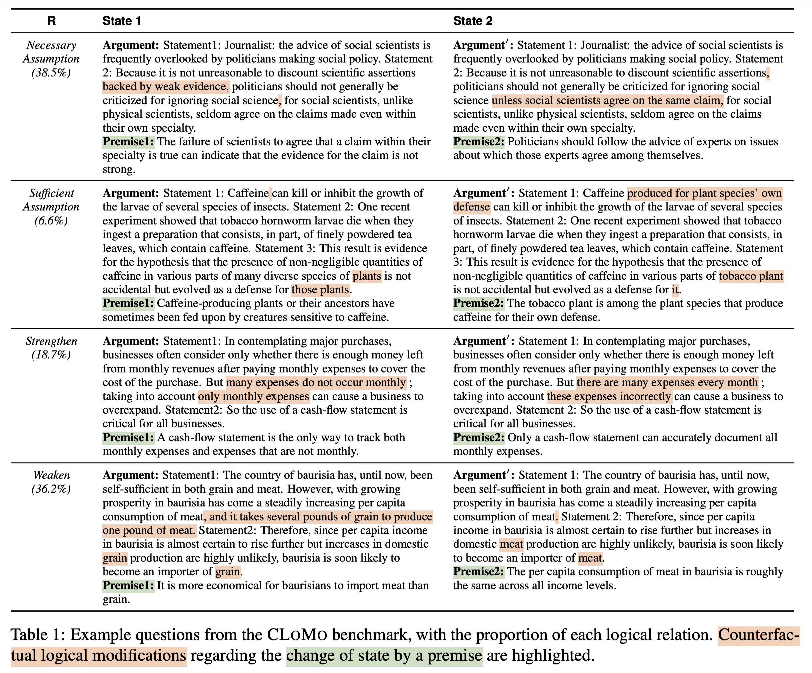
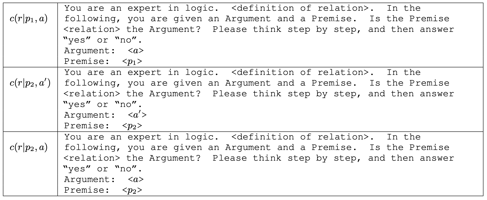

# CLOMO: Counterfactual Logical Modification with Large Language Models

Official repository for ACL 2024 paper "[CLOMO: Counterfactual Logical Modification with Large Language Models](https://arxiv.org/pdf/2311.17438.pdf)".

For more details, please refer to the project page: https://clomo-logic.github.io/.

[[Webpage](https://clomo-logic.github.io/)]
[[Paper](https://arxiv.org/pdf/2311.17438.pdf)]
[[Dataset]()]
[[Examples]()]


## About CLOMO
<!-- Task and Dataset -->
In the <b><u>C</u></b>ounterfactual <b><u>Lo</u></b>gical <b><u>Mo</u></b>dification (<b>CLOMO</b>) task, a model is given a pair of <em>Argument</em> and <em>Premise 1</em> in the relation <em>R</em>, and then is given an additional <em>Premise 2</em> that perturbs <em>R</em>. The model is required to modify <em>Argument</em> to <em>Argument'</em> such that <em>R</em> stands in the <em>Argument'</em>-<em>Premise 2</em> pair.
<div align="center">

</div>

<br>
We thus introduce the CLOMO dataset with 1,000 high-quality and challenging questions in four logical relations. The data is collected by multi-turn human annotation and verification.
<div align="center">

<p class="content has-text-centered">
Four categories of logical restrictions in CLOMO. 
</p>
</div>

<br>
Additionally, we introduce a <em>Self-Evaluation Score (SES)</em> for the logically consistent generation in CLOMO. SES decomposes the evaluation into several LLMs basic discrimination tasks, which is demonstrated comparable with human evaluation. 

$$s = c(r|p_1, a) \times c(r|p_2, a') - c(r|p_2, a) \times c(r|p_2, a')$$

<div align="center">

<p class="content has-text-centered">
Decomposed SES evaluation tasks. 
</p>
</div>


## Dataset
The overall CLOMO dataset can be downloaded in [data/](data/). We release CLOMO data with three prompting setups:

*Setup* | Train | Dev | Test |
----- | ----- | ----- | ----- |
Plain CoT | [cot_train.json](data/cot_train.json) | [cot_dev.json](data/cot_dev.json) | [cot_test.json](data/cot_test.json) |
Few-shot | [few_train.json](data/few_train.json) | [few_dev.json](data/few_dev.json) | [few_test.json](data/few_test.json) |
Zero-shot | [zero_train.json](data/zero_train.json) | [zero_dev.json](data/zero_dev.json) | [zero_test.json](data/zero_test.json) |
#Sample | 600 | 200 | 200 |


We also release the exclusive and picked-out subsets we used for the ablation study on unseen logical relation in Table 6 in the [Paper](https://arxiv.org/pdf/2311.17438.pdf).

* The exclusive subsets w/o R: [data/type_excluded](data/type_excluded)/*_xR_train.json. Each subset contains **373** samples. 

* The picked-out subsets of R: [data/type_picked](data/type_picked)/*_oR_test.json. Each subset size is included in the following table. 
 

*Setup* | R=NA | R=SA | R=S | R=W |
----- | ----- | ----- | ----- | ----- |
*Plain CoT*
train w/o R | [cot_xna_train.json](data/type_excluded/cot_xna_train.json) | [cot_xsa_train.json](data/type_excluded/cot_xsa_train.json) | [cot_xs_train.json](data/type_excluded/cot_xs_train.json) | [cot_xw_train.json](data/type_excluded/cot_xw_train.json) | 
test on R | [cot_ona_test.json](data/type_picked/cot_ona_test.json) | [cot_osa_test.json](data/type_picked/cot_osa_test.json) | [cot_os_test.json](data/type_picked/cot_os_test.json) | [cot_ow_test.json](data/type_picked/cot_ow_test.json) |
#test on R | 79 | 14 | 35 | 72 |
*Few-shot* 
train w/o R | [few_xna_train.json](data/type_excluded/few_xna_train.json) | [few_xsa_train.json](data/type_excluded/few_xsa_train.json) | [few_xs_train.json](data/type_excluded/few_xs_train.json) | [few_xw_train.json](data/type_excluded/few_xw_train.json) |
test on R | [few_ona_test.json](data/type_picked/few_ona_test.json) | [few_osa_test.json](data/type_picked/few_osa_test.json) | [few_os_test.json](data/type_picked/few_os_test.json) | [few_ow_test.json](data/type_picked/few_ow_test.json) |
#test on R | 79 | 14 | 35 | 72 |
*Zero-shot*
train w/o R | [zero_xna_train.json](data/type_excluded/zero_xna_train.json) | [zero_xsa_train.json](data/type_excluded/zero_xsa_train.json) | [zero_xs_train.json](data/type_excluded/zero_xs_train.json) | [zero_xw_train.json](data/type_excluded/zero_xw_train.json) |
test on R | [zero_ona_test.json](data/type_picked/zero_ona_test.json) | [zero_osa_test.json](data/type_picked/zero_osa_test.json) | [zero_os_test.json](data/type_picked/zero_os_test.json) | [zero_ow_test.json](data/type_picked/zero_ow_test.json) |
#test on R | 79 | 14 | 35 | 72 |

** **Remark**:
**NA**: Necessary Assumption;
**SA**: Sufficient Assumption;
**S**: Strengthen;
**W**: Weaken.


<!-- ## Training -->
## Inference 
### Output Format
Please refer to the following template to prepare your result json file for SES evaluation: [template_pred.json](output_template/template_pred.json).

### Run Inference
First, make sure you have installed all requirements:
```
pip install -r requirements.txt
```

For inference using API key, run:
```
cd inference_only
python LLMer_inference.py --call_type api \
--model_name MODEL_NAME --api_key API_KEY \
--data_path PATH_TO_TEST_JSON_FILE \
--save_path PATH_TO_SAVE_RESULTS
```

For inference using local LLM, run:
```
cd inference_only
CUDA_VISIBLE_DEVICES=0 python LLMer_inference.py --call_type llm \
--model_name MODEL_NAME --local_dir LOCAL_DIR \
--data_path PATH_TO_TEST_JSON_FILE \
--save_path PATH_TO_SAVE_RESULTS
```

Additionally, a sample script of experiments on small LMs in Table 7 in the [Paper](https://arxiv.org/pdf/2311.17438.pdf) is provided: [LLMer_inference.sh](inference_only/LLMer_inference.sh).


### Fine-tuning with CLOMO
Coming soon.


## Evaluation with SES Score
First, prepare your result json file in the format as [template_pred.json](output_template/template_pred.json).

Then, run:
```
python SES/ses.py \
--model_pred_file PATH_TO_PRED_JSON_FILE \
--api_model LLM_NAME \
--api_key API_KEY \
--api_org API_ORG
```


## Cite
If you find **CLOMO** useful, please kindly cite:
```
@article{huang2023clomo,
 author = {Huang, Yinya and Hong, Ruixin and Zhang, Hongming and Shao, Wei and Yang, Zhicheng and Yu, Dong and Zhang, Changshui and Liang, Xiaodan and Song, Linqi},
 journal = {The 62nd Annual Meeting of the Association for Computational Linguistics},
 title = {{CLOMO}: Counterfactual Logical Modification with Large Language Models},
 booktitle = {The 62nd Annual Meeting of the Association for Computational Linguistics (ACL 2024)},
 year = {2024}
}
```
